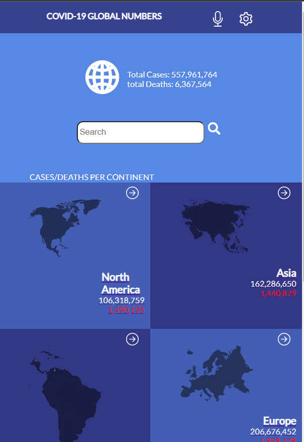
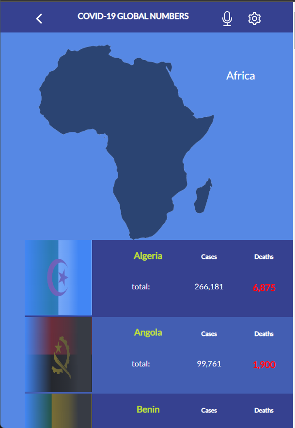

# GLOBAL COVID-19 STATS

> This websapp displays global metric data from the Disease.sh API for covid-19 cases.

## Images

## Built With

This project was bootstrapped with [Create React App](https://github.com/facebook/create-react-app).
- HTML5, CSS3, JS ES6
- React & Redux
- Webpack
- Linters: ESLint, Stylelint, Webhint
- GitFlow
- Jest

## Presentetion Video

-[Loom video](https://www.loom.com/share/8156a8734fb640c0803d4861db253ac7)

## Author

👤 **Artur Gouveia**

- [GitHub](https://github.com/Arturgouveia1970)
- [Twitter](https://twitter.com/@arturgouveia10)
- [LinkedIn](https://www.linkedin.com/in/artur-gouveia-323868197/)

## Live Demo
- [netlify](https://global-covid-19-numbers.netlify.app/)
   
## Getting Started

To get a local copy up and running follow these simple example steps.

### Prerequisites

You must have a browser on your device, a visual code, a git version installed, node.js installed in your device.

### Usage

Set up the project by cloning and changing into the repo directory:
https://github.com/Arturgouveia1970/Space-project.git

## 🤝 Contributing

Contributions, issues, and feature requests are welcome!
Feel free to check the [issues page](../../issues/).

## Show your support

Give a ⭐️ if you like this project!

## 📝 License

-[LICENCE](./LICENSE)
